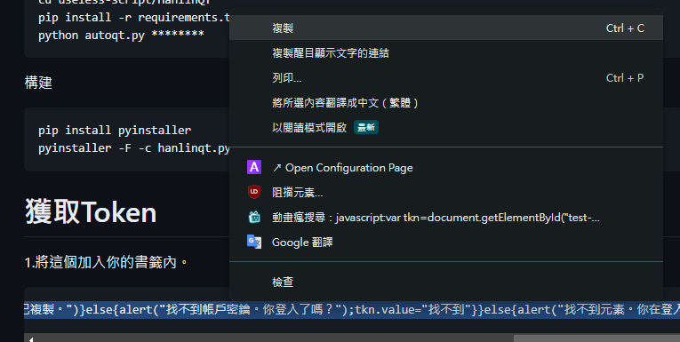
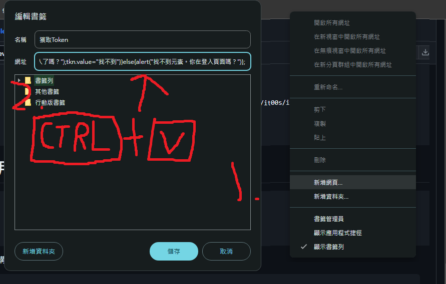
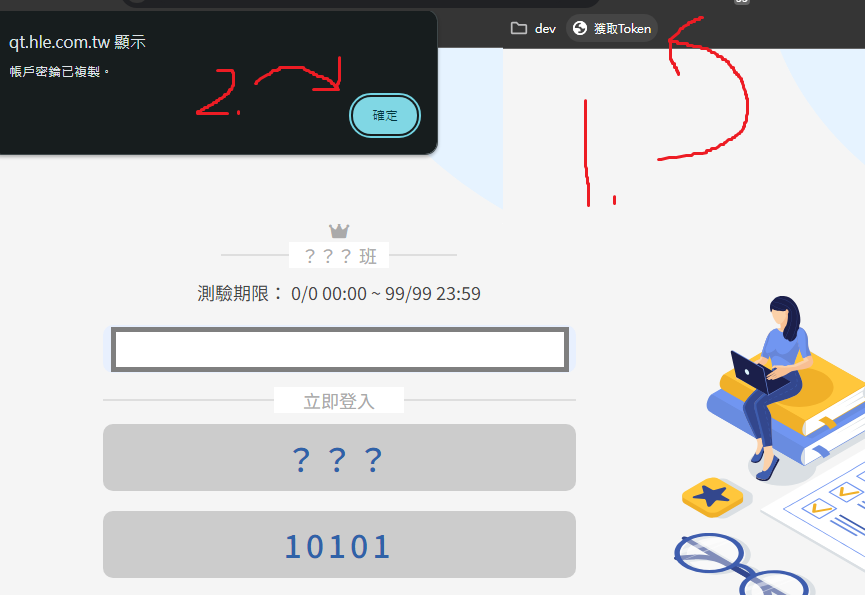

# 翰林任務中心-自動作答器
獲取答案並自動作答。支持隨機猜題與等待。
從[這裡](https://github.com/AvianJay/useless-script/releases/tag/HanlinAutoQT-1.0)取得最新的版本
# 範例用法
<pre>$>python autoqt.py --help
usage: autoqt.py [-h] [-t TOKEN] [-n NAME] [-s SEAT] [-i ID] [-r RANDOMQS] [-sk] [-w WAIT]

options:
  -h, --help            show this help message and exit
  -t TOKEN, --token TOKEN
                        帳戶Token
  -n NAME, --name NAME  名字
  -s SEAT, --seat SEAT  座號
  -i ID, --id ID        題目的ID
  -r RANDOMQS, --random RANDOMQS
                        隨機作答題數
  -sk, --skip-random-check
                        跳過確認隨機作答提醒
  -w WAIT, --wait WAIT  等待秒數

$>python autoqt.py -i ******** -n thisismyname -s 10 -r 5 -w 10
任務名稱： ***
得到任務ID: ***_*** 課程ID: ***
正在發送開始作答請求...
成功。 ID為 ******
開始生成所有正確答案...
共有 27 題(不包含子題目)，開始獲取...
100%|███████████████████████████████████| 27/27 [00:39<00:00,  1.48s/it]
獲取到 27 個題目，其中有 0 個子題目，共 0 個錯誤
成功。
已指定隨機答案 5 個。正在生成...
成功。
本來的答案： ['4', '4', '3', '3', '2']
現在的答案： ['2', '2', '1', '1', '2']
是否繼續或重新生成答案?(Y/n) n
成功。
本來的答案： ['2', '4', '4', '2', '2']
現在的答案： ['4', '4', '2', '2', '2']
是否繼續或重新生成答案?(Y/n) y
已指定等待送出時間。
 10 秒。正在等待...
100%|███████████████████████████████████| 10/10 [00:10<00:00,  1.00s/it]
正在發送答案...
成功。
結果網址: https://qt.hle.com.tw/paper.html?id=******</pre>
# 用源代碼執行&構建
<pre>git clone https://github.com/AvianJay/useless-script.git
cd useless-script/HanlinQT
pip install -r requirements.txt
python autoqt.py ********</pre>
構建
<pre>pip install pyinstaller
pyinstaller -F -c autoqt.py
</pre>
# 獲取Token
1. 將這個加入你的書籤內。
<pre>javascript:var tkn=document.getElementById("test-name");if(tkn){if(localStorage.token){tkn.value=localStorage.token;tkn.select();tkn.setSelectionRange(0,99999);navigator.clipboard.writeText(tkn.value);alert("帳戶密鑰已複製。")}else{alert("找不到帳戶密鑰。你登入了嗎？");tkn.value="找不到"}}else{alert("找不到元素。你在登入頁面嗎？")};</pre>

2. 在已登入的狀態下前往登入畫面並開啟書籤。
