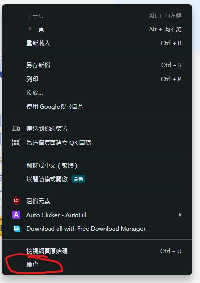
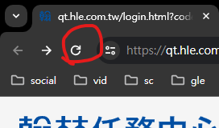
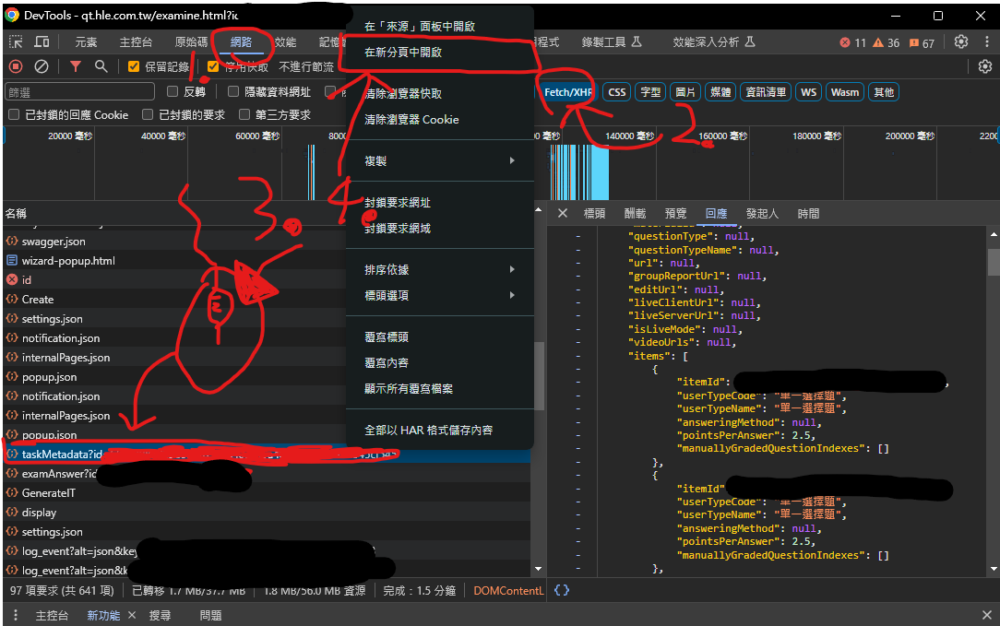
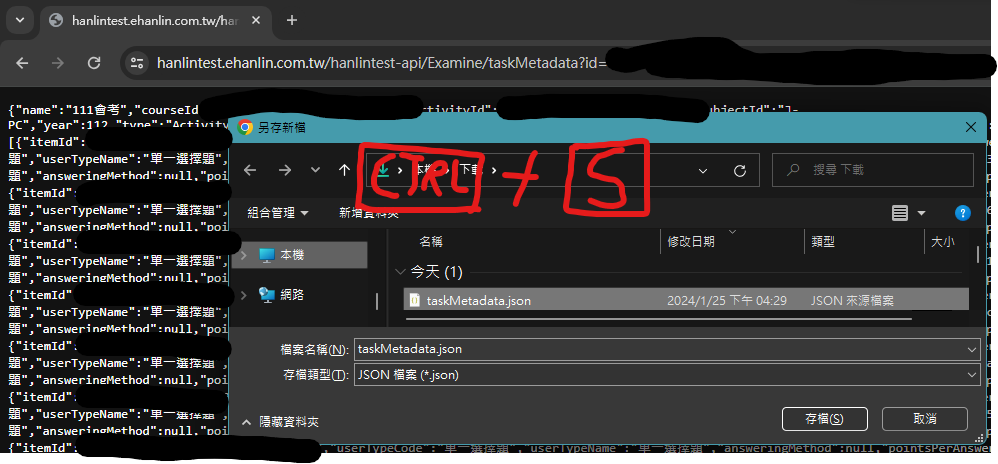

# 翰林任務中心-答案獲取器
獲取答案。
# 範例用法
<pre>$>python hleexam.py --help
usage: hleexam.py [-h] [-i ID] [-s SAVENAME] [-j JSON_PATH] [-g GENHTML]

options:
  -h, --help            show this help message and exit
  -i ID, --id ID        題目的ID
  -s SAVENAME, --savename SAVENAME
                        保存的json檔案名稱
  -j JSON_PATH, --json JSON_PATH
                        taskMetadata的JSON路徑
  -g GENHTML, --genhtml GENHTML
                        生成HTML的檔案名稱

$>python hleexam.py -i ******** -s chinese.json -g chinese.html
得到任務ID: ************************_************************
獲取到 50 個題目，共 0 個錯誤
成功儲存題目到 chinese.json
成功創建HTML到 chinese.html</pre>
# 獲取taskMetadata
1. 右鍵檢查進入DevTools

2. 重新整理

3. 進入網路抓取taskMetadata連結

4. 下載taskMetadata
